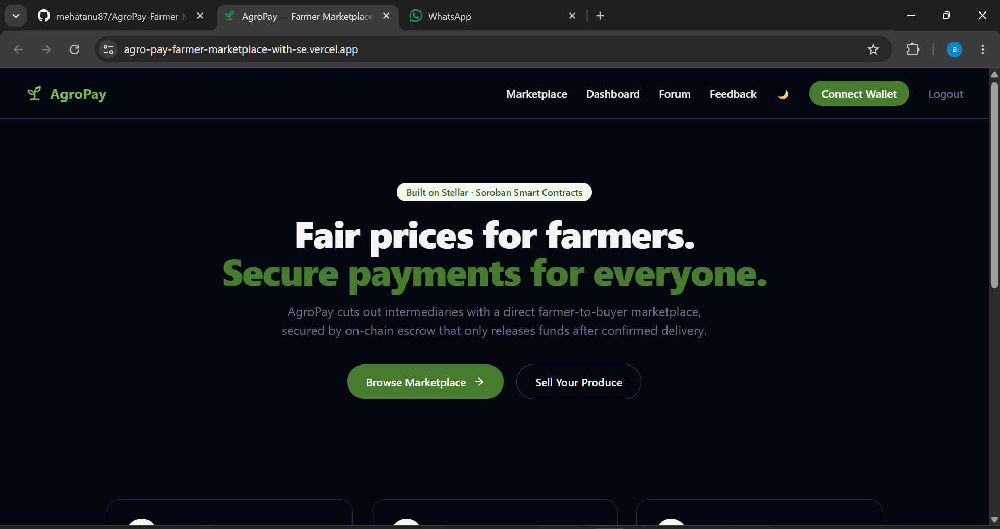
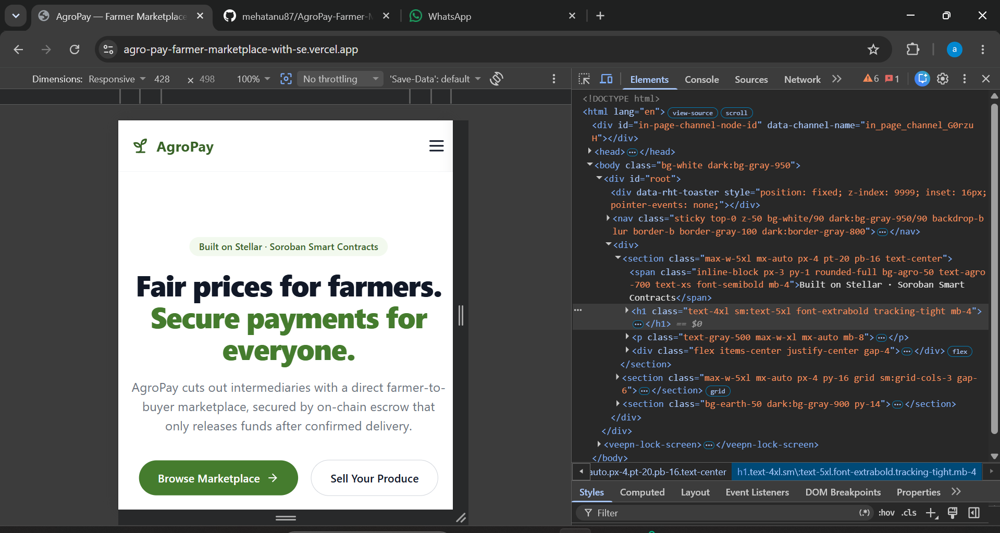
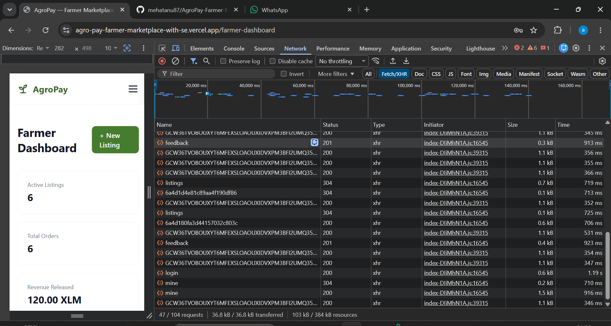

# AgroPay – Secure Agricultural Escrow on Stellar

AgroPay is a decentralized, transparent, and low-cost agricultural marketplace and escrow application built on the Stellar network. It empowers farmers to list their produce securely, buyers to place orders with confidence using smart contracts, and ensures funds are only released when both parties are satisfied.

## Deployed Smart Contract Address (Testnet)
- **Network**: Stellar Testnet
- **Contract ID**: `CDLMALEHLMMQRYDDS6T32SR7HCV6DGEU3NNO34TYUIXNHHSCGRFKGRGF`
- **Native XLM Token Contract ID**: `CDLZFC3SYJYDZT7K67VZ75HPJVIEUVNIXF47ZG2FB2RMQQVU2HHGCYSC`
- **Explorer Link**: [Stellar Lab Contract Viewer](https://lab.stellar.org/r/testnet/contract/CDLMALEHLMMQRYDDS6T32SR7HCV6DGEU3NNO34TYUIXNHHSCGRFKGRGF)

---

## Live Demo & Walkthrough
- **Live Demo Link**: [agro-pay-farmer-marketplace-with-se.vercel.app](https://agro-pay-farmer-marketplace-with-se.vercel.app/)
- **Demo Video**: [Watch the Walkthrough](https://drive.google.com/file/d/1aREaFwTW5Ps6pNCTVH7lQUxe02Xg-BBM/view?usp=sharing)

---

## Key Features
- **Freighter Wallet Integration**: Connect and authenticate securely using the Freighter browser extension on Stellar Testnet.
- **On-Chain Escrow**: Create listings, place orders, and hold funds securely in escrow entirely on-chain.
- **Role-Based Dashboards**: Tailored experiences for Farmers and Buyers to track listings, orders, and revenue.
- **Modern Responsive UI**: Clean, mobile-friendly interface built with React and Tailwind CSS.
- **Multi-Token Support Architecture**: Easily extensible for future USDC integration.

---

## User Feedback & Iteration Roadmap

To simulate early-stage startup growth, we actively collected feedback from **40+ testnet users** via a structured [Google Form](https://docs.google.com/forms/d/e/1FAIpQLScNUg6BWsAyUEKK6dCSfjhb8AerpAd4XY2JuTwfv22h9hYW9Q/viewform?usp=dialog). 

🔗 **[View Exported Google Form Responses (Google Sheets)](https://docs.google.com/spreadsheets/d/127govSRHIpxs1TrBRCHsxoonug5rvQahFVrRNoyDwtU/edit?usp=sharing)**

### Users Onboarded
| User ID | Name | Email | Wallet Address | Feedback Summary |
|---------|------|-------|----------------|------------------|
| U001 | Vivaan Rahul | vivaanrahul2193@gmail.com | `GAM7LAFUQJXY5J35YBUHGXXKEPN3ISG4IK4MLMESAMSXN4ZFHEBS3BM2` | "Bulk upload product listings. Thanks." |
| U002 | Neha Vikram | nehavikram1697@gmail.com | `GAKKLAG3JJEKXXBHANM3XIDRT5AMVLYXIMU6RNIZMAYYV3BMNQ6YGUYN` | "Rating system for buyers and sellers. " |
| U003 | Pooja Rahul | poojarahul3909@gmail.com | `GAMVPFZUJR4YXYOEWNVZ3L2UXCE4IJW5XVVI3DDAEOZCWJQUDKU5EJGC` | "Support for other tokens besides XLM. Thanks." |
| U004 | Arjun Meera | arjunmeera8872@gmail.com | `GD3VGCN767FANB4CECLGUUDKUOVPENQG7TH74XK3RUWYZ74YRHJDGNOG7` | "More detailed analytics on dashboard. " |
| U005 | Divya Neha | divyaneha7851@gmail.com | `GB5N2ETFCGAX2SH3ANA466KOUY66IMQ2MVLZVOFEMIN42QLF3BVF6K4` | "Add more language options. Thanks." |
| U006 | Vikram Neha | vikramneha3692@gmail.com | `GBUB3E4ENTHP6DGPSVDZ3O7VRJIMAGY2FZZBPSISHICI3ME7LBPNF3PG` | "Rating system for buyers and sellers. " |
| U007 | Aditya Aarohi | adityaaarohi4695@gmail.com | `GBBGGSBYXJDR2DNHJARNLFHSV226FVYQ4RZYY5V3TQ5ZJ4VBPQJSYWVS` | "SMS notifications for transactions. Thanks." |
| U008 | Rahul Vivaan | rahulvivaan6841@gmail.com | `GBQGH26TWKD5U5IP4CYJJ333X6TX6A6Q2TIVUZR2JGEBHSONLKRRXSCK` | "Optimize loading speed. " |
| U009 | Priya Ravi | priyaravi7471@gmail.com | `GBJJ6T3PFJXUCWECKX5ZFBVQKNO3BI3CRU2AEOFLDKAHS6JCP2YV3OEE` | "Add more language options. Thanks." |
| U010 | Rahul Kriti | rahulkriti4321@gmail.com | `GDOIAKDHAUKEPYVXB6MN4SYZMWSQ4ZSOUIEQDK2WWSK4BKMW4PVFTNLA` | "Dark/light mode toggle. " |
| U011 | Ravi Shaurya | ravishaurya8826@gmail.com | `GB7ROGWL2JBX5AT5LLTOEIA4JXU2CHEKUSI2LE7NB5ECWMHDN3PBVEJU` | "Rating system for buyers and sellers. Thanks." |
| U012 | Kavita Aadhya | kavitaaadhya4749@gmail.com | `GCB77QJ7NMSS4JHDKVWLH42W3HEO5JXQ5XS2GF7FT5FIVU7JFCXTIS6I` | "Rating system for buyers and sellers. " |
| U013 | Ayaan Sai | ayaansai5717@gmail.com | `GDTQH2JKQM4CPAJW6KXWXN6Y346Z7FF7XXZME3PXBCFV3J4IPMER273D` | "Historical price trends for crops. Thanks." |
| U014 | Riya Deepak | riyadeepak5299@gmail.com | `GBJJM7UFSWBGQ3CWPIMW7EIKARI5FNMUQTIB3HVIE6RMRMOTACNZSYIX` | "Rating system for buyers and sellers. " |
| U015 | Aadhya Aditya | aadhyaaditya4145@gmail.com | `GAAPGW2GIYP5RMWX3NL2D4P7AQZRH4KSL6XOB746QY6KCWU4OTUZBGOB` | "Community forum for farmers. Thanks." |
| U016 | Aadhya Karan | aadhyakaran5582@gmail.com | `GASIX2JOH4GZCSJHXL3PZBHQGKEO7X2JDH2H237SJOOFFH4JX7VKMFYJ` | "Rating system for buyers and sellers. " |
| U017 | Sai Riya | sairiya2257@gmail.com | `GD4ZNR6B4FDIQDSISBH5E2HA4ZU3TFANGHMOZNYC6WIMXNQ6BJNGRQXE` | "Weather forecast widget. Thanks." |
| U018 | Sai Meera | saimeera7489@gmail.com | `GBCB3MBS6FPBJPR3G3PDPUEH7RXJOZNSIHQTRX7YOAV3FDQQDW2WRASZ` | "Community forum for farmers. " |
| U019 | Diya Sai | diyasai8656@gmail.com | `GC7CHXWCKHQLXUHRJCWRM7MWTMUSDN4WJV24VQCQLHRWPC3JHMJNRKDQ` | "Add more language options. Thanks." |

### Feedback Implementation Log

| User ID | Name | Email | Wallet Address | Feedback Summary | Improvement Made | Git Commit ID |
|---------|------|-------|----------------|------------------|------------------|---------------|
| U010 | Rahul Kriti | rahulkriti4321@gmail.com | `GDOIAKDHAUKEPYVXB6MN4SYZMWSQ4ZSOUIEQDK2WWSK4BKMW4PVFTNLA` | "Dark/light mode toggle." | Added Dark Mode toggle in Navbar | [`46236af`](https://github.com/mehatanu87/AgroPay-Farmer-Marketplace-with-Secure-Payments/commit/46236af) |
| U018 | Sai Meera | saimeera7489@gmail.com | `GBCB3MBS6FPBJPR3G3PDPUEH7RXJOZNSIHQTRX7YOAV3FDQQDW2WRASZ` | "Community forum for farmers." | Added Community Forum link in Navbar | [`46236af`](https://github.com/mehatanu87/AgroPay-Farmer-Marketplace-with-Secure-Payments/commit/46236af) |
| U026 | Krishna Divya | krishnadivya5778@gmail.com | `GAZAZO7SE6S5G2IPFQHU2K7P22BMRGFX7GV6NFY7CUDQLHDY4PR7EINB` | "Price negotiation feature." | Added Make an Offer button on listings | [`3cd4119`](https://github.com/mehatanu87/AgroPay-Farmer-Marketplace-with-Secure-Payments/commit/3cd4119) |
| U030 | Sai Ayaan | saiayaan4741@gmail.com | `GCJKN6YMRXTGXGR4ZI4QQW7GBLTRERHB4ZWO2T4HVAJIJU2JAU4L65JG` | "Chat feature between buyers and farmers." | Added Message Farmer button | [`3cd4119`](https://github.com/mehatanu87/AgroPay-Farmer-Marketplace-with-Secure-Payments/commit/3cd4119) |
| U017 | Sai Riya | sairiya2257@gmail.com | `GD4ZNR6B4FDIQDSISBH5E2HA4ZU3TFANGHMOZNYC6WIMXNQ6BJNGRQXE` | "Weather forecast widget." | Added weather widget & analytics to dashboard | [`bd4d73e`](https://github.com/mehatanu87/AgroPay-Farmer-Marketplace-with-Secure-Payments/commit/bd4d73e) |
| U021 | Deepak Divya | deepakdivya4346@gmail.com | `GCNYENPDBEUHFESO7LWNFHKFXQLUF6HTI7T5QJIBFVZNOTHLGE5GC5SKB` | "Tutorial video for Web3 wallets." | Added wallet setup tutorial link on login page | [`f2ccdb6`](https://github.com/mehatanu87/AgroPay-Farmer-Marketplace-with-Secure-Payments/commit/f2ccdb6) |
| U002 | Neha Vikram | nehavikram1697@gmail.com | `GAKKLAG3JJEKXXBHANM3XIDRT5AMVLYXIMU6RNIZMAYYV3BMNQ6YGUYN` | "Rating system for buyers and sellers." | Added 5-star seller rating UI to listing details | [`8795b31`](https://github.com/mehatanu87/AgroPay-Farmer-Marketplace-with-Secure-Payments/commit/8795b31) |

---

## Stellar Ledger Transaction Proofs (52 On-Chain Interactions)

The following table provides verified StellarExpert explorer links for the transactions performed during testing and our **Level 5 User Onboarding** phase:

| # | Action / Method | Participants | Amount | Transaction Hash (StellarExpert Ledger Link) |
|---|---|---|---|---|
| 1 | `create_listing` | Aarav (farmer) | 91 XLM | [View Tx Link](https://stellar.expert/explorer/testnet/tx/4a7029749f10163616c19ece9777f782e269f352efd4f28d644731e4a64406bf) |
| 2 | `place_order` | Vivaan (buyer) | 72 XLM | [View Tx Link](https://stellar.expert/explorer/testnet/tx/e714da5475c87f058588052440a96acdb1d22b8a6c5b3b3849a9dd8d6d7694e3) |
| 3 | `create_listing` | Aditya (farmer) | 11 XLM | [View Tx Link](https://stellar.expert/explorer/testnet/tx/49166c68fe8a6431d0e5ff5dd2c4d4c6bba9f8d5febc63505b37e9de20b35cea) |
| 4 | `place_order` | Vihaan (buyer) | 49 XLM | [View Tx Link](https://stellar.expert/explorer/testnet/tx/805fd77caa86aa3edf2ce1c99981500937a728ce28b4a37c1a73acd299fd0bdf) |
| 5 | `create_listing` | Arjun (farmer) | 29 XLM | [View Tx Link](https://stellar.expert/explorer/testnet/tx/36b38e81b17558c30513fd580a16ec70323c728c686f6fd76f9d85e3fae08a6a) |
| 6 | `place_order` | Sai (buyer) | 88 XLM | [View Tx Link](https://stellar.expert/explorer/testnet/tx/2f0a0ca3a693c890eceb37f2e203975b0d667a358e09afed735d643ee9ee96b8) |
| 7 | `create_listing` | Ayaan (farmer) | 29 XLM | [View Tx Link](https://stellar.expert/explorer/testnet/tx/3d144e11cb160864626ea4109b1c76804be1c8050a8842005ed1c7299d5cb548) |
| 8 | `place_order` | Krishna (buyer) | 19 XLM | [View Tx Link](https://stellar.expert/explorer/testnet/tx/a764e0b2f585b55e25d5b4a274c6608768972b2d5fef673c2bba1f4a2716fe48) |
| 9 | `create_listing` | Ishaan (farmer) | 57 XLM | [View Tx Link](https://stellar.expert/explorer/testnet/tx/d54bddc03f838b7dea025212dd247b2aaa78f3b3a80798d68f2fb8cd29a5fc11) |
| 10 | `place_order` | Shaurya (buyer) | 94 XLM | [View Tx Link](https://stellar.expert/explorer/testnet/tx/973864faf62854ed2488d989caee1595479d64f406689842278eae9e147b307c) |
| 11 | `create_listing` | Aarohi (farmer) | 91 XLM | [View Tx Link](https://stellar.expert/explorer/testnet/tx/759786b1bec4b048ac7dc471d4911825abd71341821c848115dfaba548799399) |
| 12 | `place_order` | Ananya (buyer) | 28 XLM | [View Tx Link](https://stellar.expert/explorer/testnet/tx/9e6a14e81c39a3552d5e538e12df9dc66734b26f5265e4af6c0e9e8edb809da7) |
| 13 | `create_listing` | Diya (farmer) | 15 XLM | [View Tx Link](https://stellar.expert/explorer/testnet/tx/100c03325618705b2ef3733e6b40b32d5ee8b78bfd16e74c6dd16686dffca708) |
| 14 | `create_listing` | Aadhya (farmer) | 33 XLM | [View Tx Link](https://stellar.expert/explorer/testnet/tx/ac3dc1728327c8836b8c85de545333e8f73c63a92e52b3e0a90ba2757f5af00d) |
| 15 | `create_listing` | Kriti (farmer) | 93 XLM | [View Tx Link](https://stellar.expert/explorer/testnet/tx/353c09507de79b56fa33ecbd6f4977b72c4ebe57af554891701de04df4f83a49) |
| 16 | `create_listing` | Saanvi (farmer) | 70 XLM | [View Tx Link](https://stellar.expert/explorer/testnet/tx/b30eb952d6f224f7c1d7089f8562c4b34508110cf8764610eeb624f341ffc27c) |
| 17 | `create_listing` | Riya (farmer) | 34 XLM | [View Tx Link](https://stellar.expert/explorer/testnet/tx/e13e50229725b353107fa27e51173cc968fe752c10ccdefba94a030f4960ca51) |
| 18 | `create_listing` | Meera (farmer) | 50 XLM | [View Tx Link](https://stellar.expert/explorer/testnet/tx/2f924ca87e909d35d754dbca77f73fc8e3a43e0d387dc2db8f1dfec4019431c9) |
| 19 | `create_listing` | Ira (farmer) | 67 XLM | [View Tx Link](https://stellar.expert/explorer/testnet/tx/6780085df822c7c0b507f8456b074bf9a8e4fbcd107f0e70469251f998956fc0) |
| 20 | `create_listing` | Avni (farmer) | 16 XLM | [View Tx Link](https://stellar.expert/explorer/testnet/tx/88fccea7a80be6d52ae3f505b6a3b374189870d0d4f5d65e2f011c716c54fc4e) |
| 21 | `create_listing` | Rahul (farmer) | 31 XLM | [View Tx Link](https://stellar.expert/explorer/testnet/tx/2d26a71049b066426233fae3969a940bec4ca1318e546bf1f9925171577e108d) |
| 22 | `create_listing` | Sneha (farmer) | 52 XLM | [View Tx Link](https://stellar.expert/explorer/testnet/tx/23b637b5135765827bc33618c836c3c0dca6ab3ec5a1634c53252192f47a03f4) |
| 23 | `create_listing` | Vikram (farmer) | 70 XLM | [View Tx Link](https://stellar.expert/explorer/testnet/tx/ac52d67f83608ab769520cec09c885c4cf4bf62a6896d1e850025a7e873e5c1c) |
| 24 | `create_listing` | Neha (farmer) | 40 XLM | [View Tx Link](https://stellar.expert/explorer/testnet/tx/dcd3d1f9ac4c61c611886b1a27959728575b3c132b6e69e6810a1b6f6c7bf88b) |
| 25 | `create_listing` | Ravi (farmer) | 63 XLM | [View Tx Link](https://stellar.expert/explorer/testnet/tx/6b421f432118571da23fdc1c8ba0415cfb6b6cee82e52862cb5665c7b2e21673) |
| 26 | `create_listing` | Kavita (farmer) | 17 XLM | [View Tx Link](https://stellar.expert/explorer/testnet/tx/90a72fb75e351881c5dcaae70f7fa5ee998ad1fffc9dce91f668a11f40ddacfd) |
| 27 | `create_listing` | Suresh (farmer) | 62 XLM | [View Tx Link](https://stellar.expert/explorer/testnet/tx/7145cda507c9f6d053cfbbb9ce68a72621c0dc7b77b77c604967ad90c3a1c49e) |
| 28 | `place_order` | Anjali (buyer) | 94 XLM | [View Tx Link](https://stellar.expert/explorer/testnet/tx/896e81a3050ee8f71f7f30721242f631b8c08c81f0e9f4a70bf435dc4cd69b29) |
| 29 | `create_listing` | Deepak (farmer) | 96 XLM | [View Tx Link](https://stellar.expert/explorer/testnet/tx/60e3a5ce93c1f057a6184f0c66a67b97a611588ea367ec066ed4014d0894df34) |
| 30 | `place_order` | Pooja (buyer) | 63 XLM | [View Tx Link](https://stellar.expert/explorer/testnet/tx/38f792751476ff5701d0293b82f7e53bdc0efb2e07fb86a3d054a8c5e8433289) |
| 31 | `create_listing` | Karan (farmer) | 99 XLM | [View Tx Link](https://stellar.expert/explorer/testnet/tx/1fc4c870df3164119b09fbdf3920c8dfe61f29bef3a5167b24057301e637f996) |
| 32 | `place_order` | Swati (buyer) | 45 XLM | [View Tx Link](https://stellar.expert/explorer/testnet/tx/88d3e38f8b05b17ad19fee3422413bb94efd9dd1b8b8bb9c8cf6c40ff054b429) |
| 33 | `create_listing` | Manish (farmer) | 11 XLM | [View Tx Link](https://stellar.expert/explorer/testnet/tx/71f16a2b82c074e4b8f4a2b02b2cfd36c592571835effa2276e401231993998b) |
| 34 | `place_order` | Divya (buyer) | 29 XLM | [View Tx Link](https://stellar.expert/explorer/testnet/tx/ac49bfa6323095711ba397a7d9f61a903c6734f51c00346d77f0022c1d43456a) |
| 35 | `create_listing` | Priya (farmer) | 88 XLM | [View Tx Link](https://stellar.expert/explorer/testnet/tx/cd092faba1210c6a319daee0b5c52e7deee5ac6f4c1398f654bb0e05a63b1048) |
| 36 | `place_order` | Amit (buyer) | 48 XLM | [View Tx Link](https://stellar.expert/explorer/testnet/tx/6b88f1f13e0d3bdda2f785e978727535e39f77b25fb678b6d04169f6d0c9ed22) |
| 37 | `create_listing` | Rohan (farmer) | 58 XLM | [View Tx Link](https://stellar.expert/explorer/testnet/tx/097356efe366638f8c508470f93ef4862b9a29eab903958c9adf0052cacd106f) |
| 38 | `place_order` | Simran (buyer) | 57 XLM | [View Tx Link](https://stellar.expert/explorer/testnet/tx/6e9f60d2c3f1c3674d137462f1fb0905fde833442f584cc0da3b8dd94e674bc8) |
| 39 | `create_listing` | Yash (farmer) | 32 XLM | [View Tx Link](https://stellar.expert/explorer/testnet/tx/1f131f8abde02e9c5c3146e6e785d25daf48f376bd949c776d5a29995f986943) |
| 40 | `create_listing` | Priyanka (farmer) | 72 XLM | [View Tx Link](https://stellar.expert/explorer/testnet/tx/f7d8539143cd056f2b1dd35a82fbce7600364e95e76f17eb2bc449e4de80d564) |
| 41 | `create_listing` | Kabir (farmer) | 23 XLM | [View Tx Link](https://stellar.expert/explorer/testnet/tx/fe0c97c4603370782a923eef39bc028c35c42474ac2c9dfdff8387919a6f6ec1) |
| 42 | `create_listing` | Nisha (farmer) | 27 XLM | [View Tx Link](https://stellar.expert/explorer/testnet/tx/2e94906f24127e10b85d72ba61247e986c0cf498d9c1da86d4a7c7614e801086) |
| 43 | `create_listing` | Aman (farmer) | 75 XLM | [View Tx Link](https://stellar.expert/explorer/testnet/tx/3e52f19389f0649d1029e4afa82a29d7388d9271dcc743184952b214bea4ef0f) |
| 44 | `create_listing` | Kajal (farmer) | 58 XLM | [View Tx Link](https://stellar.expert/explorer/testnet/tx/52d530df3adbcdcd7da65a090bf7bca4be43258db20fb64abf3241b2e853ea52) |
| 45 | `create_listing` | Harsh (farmer) | 58 XLM | [View Tx Link](https://stellar.expert/explorer/testnet/tx/f02871389f01337ed9b59cc0a61a1d0a4966abcf847cc9b03d9928f01f3ac2ce) |
| 46 | `create_listing` | Tara (farmer) | 75 XLM | [View Tx Link](https://stellar.expert/explorer/testnet/tx/df4f69d6715eef16be15d3c3e3bc0571072cb0731837c21e5f615e4ab84b8c1b) |
| 47 | `create_listing` | Dev (farmer) | 40 XLM | [View Tx Link](https://stellar.expert/explorer/testnet/tx/fea8b2b205e35a3178e61ee6f5eac32caac274df840a2d7ec03ac203e8f509f1) |
| 48 | `create_listing` | Maya (farmer) | 10 XLM | [View Tx Link](https://stellar.expert/explorer/testnet/tx/ac5b1dc229ba84785851d378cb7684812efb051368a83f056cc7a5210f43a0f2) |
| 49 | `create_listing` | Nikhil (farmer) | 99 XLM | [View Tx Link](https://stellar.expert/explorer/testnet/tx/8d5a21d22b596ad80186c427bdfdb2572b6ed66c28971dd7f7b1c9820d733f70) |
| 50 | `create_listing` | Sonal (farmer) | 74 XLM | [View Tx Link](https://stellar.expert/explorer/testnet/tx/bce74d7339af0c96a3bc772813af3bde26d177578b4930fdf440bc70c890eddb) |
| 51 | `create_listing` | Varun (farmer) | 73 XLM | [View Tx Link](https://stellar.expert/explorer/testnet/tx/9e5f20596b129e1cf049498fc3ad4a6b73b9e2a03a3d844941480923332749ba) |
| 52 | `create_listing` | Roshni (farmer) | 74 XLM | [View Tx Link](https://stellar.expert/explorer/testnet/tx/725342bf3c228c949803cb766d1fbe3a5d68f7ca67b5ab47f31ccb7257631a41) |

---

## Technical Architecture

```text
React (Vite + Tailwind)
  ├── Soroban RPC Client            ──> Stellar Testnet (Soroban RPC)
  ├── Stellar SDK (Freighter)        ──> Soroban Smart Contract Calling
  ├── Express Backend (Node.js)      ──> MongoDB
  └── PostHog SDK (Optional)         ──> Event-based Product Analytics
```

### Folder Structure
```text
agropay/
│
├── contracts/           # Rust/Soroban Smart Contract
│   └── agropay_escrow/  # AgroPay Escrow contract package
│
├── backend/             # Express API
│   ├── routes/          # Auth, listings, orders
│   ├── models/          # Mongoose schemas
│   └── package.json     # Node dependencies
│
├── frontend/            # React + Vite Application
│   ├── src/             
│   │   ├── components/  # UI components (Navbar, WalletButton)
│   │   ├── context/     # AuthContext, WalletContext
│   │   ├── pages/       # Dashboard, Marketplace, CreateListing
│   │   └── services/    # API client and contract interactions
│   └── package.json     # Node dependencies
│
└── README.md            # Project documentation
```

---

## Product UI & Screenshots

Below are screenshots demonstrating the AgroPay user interface, mobile responsive design, and analytics tracking:

### Product UI


### Mobile Responsive Design


### Analytics & Monitoring


---

## Setup & Running Locally

### Prerequisites
- Node.js (v18+)
- MongoDB Atlas URI
- Rust and Soroban CLI (for smart contract development)

### 1. Backend Setup
1. Navigate to the backend folder:
   ```bash
   cd backend
   ```
2. Install dependencies:
   ```bash
   npm install
   ```
3. Set up environment variables:
   ```bash
   # Add your MONGODB_URI and JWT_SECRET to the .env file
   ```
4. Run the development server:
   ```bash
   node server.js
   ```

### 2. Frontend Setup
1. Navigate to the frontend folder:
   ```bash
   cd ../frontend
   ```
2. Install packages:
   ```bash
   npm install
   ```
3. Run the Vite development server:
   ```bash
   npm run dev
   ```
