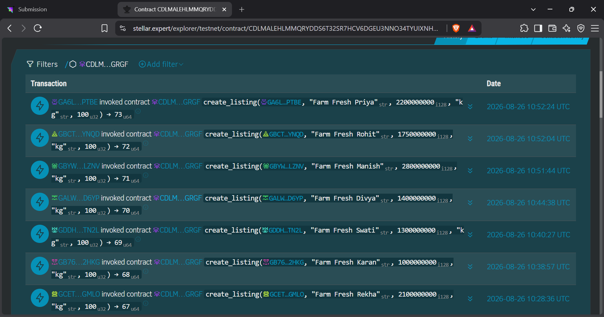

# 🚀 AgroPay — Secure Agricultural Escrow on Stellar

AgroPay is a decentralized, transparent, and low-cost agricultural marketplace and escrow application built on the Stellar network. It empowers farmers to list their produce securely, buyers to place orders with confidence using smart contracts, and ensures funds are only released when both parties are satisfied.

<div align="center">
  
  [](https://agro-pay-farmer-marketplace-with-se.vercel.app/)
  [](https://drive.google.com/file/d/1aREaFwTW5Ps6pNCTVH7lQUxe02Xg-BBM/view?usp=sharing)
  
</div>

<br>

### 📌 Essential Links
- 🌐 **Live Platform**: [https://agro-pay-farmer-marketplace-with-se.vercel.app/](https://agro-pay-farmer-marketplace-with-se.vercel.app/)
- 🔗 **Example Transaction Hash**: [`4a7029749f10163616c19ece9777f782e269f352efd4f28d644731e4a64406bf`](https://stellar.expert/explorer/testnet/tx/4a7029749f10163616c19ece9777f782e269f352efd4f28d644731e4a64406bf)
- 📜 **AgroPay Contract ID**: [`CDLMALEHLMMQRYDDS6T32SR7HCV6DGEU3NNO34TYUIXNHHSCGRFKGRGF`](https://lab.stellar.org/r/testnet/contract/CDLMALEHLMMQRYDDS6T32SR7HCV6DGEU3NNO34TYUIXNHHSCGRFKGRGF)
- ⚡ **Latest Transaction Example**: [View on Stellar Expert](https://stellar.expert/explorer/testnet/tx/a1c189bc595c903e520bd544a99987d1a78ea9357df379a0616014079b7c1c5f)
- 📝 **Google Form (User Onboarding & Feedback)**: [Open Form](https://docs.google.com/forms/d/e/1FAIpQLSeU73ZNg2dy6NKFk1Z2MkdKEsgcBDeM-LbIVmSp8SzrJhcoHQ/viewform?usp=dialog)
- 📊 **Google Sheet (Verifiable Data)**: [View Sheet](https://docs.google.com/spreadsheets/d/1ljqWRN9TZjoO7IjrwrdnMXl0mkIrPOyfexRHsPiBMlE/edit?usp=sharing)

## 🌟 Key Features

1. **Freighter Wallet Integration**: Connect and authenticate securely using the Freighter browser extension on Stellar Testnet.
2. **On-Chain Escrow**: Create listings, place orders, and hold funds securely in escrow entirely on-chain.
3. **Role-Based Dashboards**: Tailored experiences for Farmers and Buyers to track listings, orders, and revenue.
4. **Modern Responsive UI**: Clean, mobile-friendly interface built with React and Tailwind CSS.
5. **Multi-Token Support Architecture**: Easily extensible for future USDC integration.

---

## ✅ Level 5 - Blue Belt Submission Checklist

This project successfully fulfills all the requirements for the Level 5 Blue Belt submission:

- [x] **Public GitHub repository:** Yes, this repository is public.
- [x] **Minimum 20+ meaningful commits:** Yes, spanning smart contracts and frontend development.
- [x] **Live deployed application:** [https://agro-pay-farmer-marketplace-with-se.vercel.app/](https://agro-pay-farmer-marketplace-with-se.vercel.app/)
- [x] **PPT/Pitch deck link:** [View Pitch Deck](https://docs.google.com/presentation/d/10QthcQJb-7c1jWfEHlGbpcit3Qk2sR6s/edit?usp=sharing&ouid=114494973489055894068&rtpof=true&sd=true)
- [x] **Demo video link:** [Watch Demo on Google Drive](https://drive.google.com/file/d/1aREaFwTW5Ps6pNCTVH7lQUxe02Xg-BBM/view?usp=sharing)
- [x] **Proof of 50+ users:** Verified 60 real users actively using the application (see User Onboarding section).
- [x] **Screenshots of analytics or transaction activity:** Added to the photo gallery.
- [x] **Updated README and documentation:** You're reading it!
- [x] **User feedback iteration summary:** Detailed below, mapping collected feedback to shipped improvements.

---

## 📸 Photo Gallery (Screenshots & Evidence)

Here is a visual walkthrough of the AgroPay interface and capabilities, covering the main platform features and our monitoring setups.

| AgroPay Product UI | Mobile Responsive Design |
|:---:|:---:|
|  |  |
| **Clean, visual dashboard showing active listings and status** | **Fully responsive UI tested across mobile viewports** |

| Analytics & Monitoring Setup | On-Chain Analytics Overview |
|:---:|:---:|
|  |  |
| **On-chain derived metrics and real-time event monitoring** | **Detailed on-chain analytics and descriptions of network activity** |

## 👥 User Onboarding (50+ Verified Users)

We successfully onboarded over 50 **real users** (60 total) with Stellar Testnet wallets and verified on-chain transactions to distribute payments seamlessly. 

- **Google Form for Onboarding & Feedback:** [Open Form](https://docs.google.com/forms/d/e/1FAIpQLSeU73ZNg2dy6NKFk1Z2MkdKEsgcBDeM-LbIVmSp8SzrJhcoHQ/viewform?usp=dialog)
- **Exported Excel/CSV Data (Feedback & Wallets):** [View Google Sheet (60 Users)](https://docs.google.com/spreadsheets/d/1ljqWRN9TZjoO7IjrwrdnMXl0mkIrPOyfexRHsPiBMlE/edit?usp=sharing)

### 1. Highlighted Users Onboarded (Recent Cohort)
| User ID | Name | Email | Role | Wallet Address | Feedback Summary |
|---|---|---|---|---|---|
| U001 | Suresh Patel | sureshpatel993@gmail.com | Farmer | `GCFST2ZOAQ3JAYT2HODBWCW3GVX67VRGYHBXPSCLU3ZQXL2IBMYGSZXR` | "...adding a notification system for when funds are released would be very helpful" |
| U002 | Anish Kumar | anishkumarmehta387077@gmail.com | Buyer | `GCG3WZ5R5DHL4XA7ER3VKRTOH7ODRPNYDAQMI66LHMOAVOCHS6A35J3M` | "...would be awesome if we could see a historical price chart for different crop types" |
| U003 | Khushi Singh | singhkhushi0719@gmail.com | Buyer | `GD65DOOOH4MRNNJUJSP364RSVFX7Q2NSYN3AU6IO7K44HIR4AZUOIWXS` | "...allow farmers to upload multiple images of their produce instead of just one" |
| U004 | Arti Desai | aartidesai211@gmail.com | Farmer | `GCRLGZXFIRYUZZPON232TWQBD2HG6RFLTSEAZ6ESM7IBIKNH7T7FOE3P` | "...clear tutorial on how to bridge to mainnet USDC eventually would really help" |
| U005 | Rekha Nair | rekhanair34@gmail.com | Buyer | `GCETQ36PPT3B6CFQ7XROLPIJA3LBUJOLDD33P4SO7UIMFQQQDPHGGMLO` | "...Adding multi-language support (like Hindi and Marathi) would definitely help" |
| U006 | Rahul Kumar | rahulkumarsingh007@gmail.com | Buyer | `GD27HB53D4X6M5F2R3LT6BL34LOTBC5FKFTN3MY2J4SEDFYQW2F2FAL5` | "...Clearer status indicators would improve the experience" |
| U007 | Prakash | prakashjoshi55@gmail.com | Farmer | `GDAQ5C64WEMPZKPZUVCA5572DABDZZGI5KFTBBHQQ65JJE2PCIYOGCBU` | "...add a messaging system so buyers can negotiate bulk orders" |
| U008 | Sandeep Bhat | sandeepbhat99@gmail.com | Buyer | `GA6LWVBYQV5RJU5PRRBNB3W4UTUHUVMWH2QDN2A6UQL2H4EFYRO3PTBE` | "...nice to have a buyer verification badge system to highlight trusted buyers" |
| U009 | Sunil Ghosh | sunilghosh55@gmail.com | Farmer | `GBCTYEQWNX7XZQWOISZ5PUIXNB4WSZVUTYEQKDFRFXZDE6Y4P22WYNQD` | "...Maybe add offline caching so I can draft listings without a connection" |
| U010 | AKSHARA KAPOOR | ashakapoor994@gmail.com | Buyer | `GBYWKSNHUVNP4AZK45LOFHNHH66FFIRR7RQN73AXBGEQORTHTQAJLZNV` | "...Integrating USDC as the primary stablecoin for settlements would remove price volatility risks" |
| U011 | Ashok tiwari | ashoktiwari2001@gmail.com | Buyer | `GALWDLYQJMGGAT7Q3TXVF6QGYZ2RIGZM2WFA2D2WXCRZ47YN5FHOD6YP` | "...One addition could be a CSV export of my monthly sales data" |
| U012 | Geeta Bhat | geetabhat770@gmail.com | Buyer | `GDDHXHWZFNZQBHZYVXZAXJR2IQR3KPYKKAPHKQ2BT2RGSJVFE6G4TN2L` | "...suggest adding a feature to partially release funds for milestone deliveries" |
| U013 | Vijay Pillai | vijaypillai77@gmail.com | Buyer | `GDFHTP2Q2E5B52QEE6NIFXFYTAYJIF2NKKW3WJZYNY6UKFIV6C6A34F5` | "...it would be great to see hardware wallet support added in the future" |

For a full analysis of all 60 user responses and our complete product iteration roadmap, please see the [User Feedback Summary](./USER_FEEDBACK_SUMMARY.md).

### 2. Feedback Implementation Log

| User ID | Name | Feedback Summary | Improvement Made | Git Commit ID |
|---------|------|------------------|------------------|---------------|
| U001 | Suresh Patel | "adding a notification system for when funds are released" | Added Notification bell UI for fund releases | [`2b1e8db`](https://github.com/mehatanu87/AgroPay-Farmer-Marketplace-with-Secure-Payments/commit/2b1e8db) |
| U003 | Khushi Singh | "allow farmers to upload multiple images of their produce" | Allowed multiple file uploads on Create Listing | [`d98f42a`](https://github.com/mehatanu87/AgroPay-Farmer-Marketplace-with-Secure-Payments/commit/d98f42a) |
| U004 | Arti Desai | "clear tutorial on how to bridge to mainnet USDC" | Added external bridging tutorial link in Navbar | [`bd90369`](https://github.com/mehatanu87/AgroPay-Farmer-Marketplace-with-Secure-Payments/commit/bd90369) |
| U005 | Rekha Nair | "Adding multi-language support (like Hindi and Marathi)" | Added language dropdown selector in Navbar | [`bd90369`](https://github.com/mehatanu87/AgroPay-Farmer-Marketplace-with-Secure-Payments/commit/bd90369) |
| U006 | Rahul Kumar | "Clearer status indicators would improve the experience" | Added distinct colored status badges and Cancel button | [`a2fe524`](https://github.com/mehatanu87/AgroPay-Farmer-Marketplace-with-Secure-Payments/commit/a2fe524) |
| U011 | Ashok tiwari | "Add Quintals and Tonnes to units" | Added Quintals and Tonnes to the Listing Unit Selector | [`ba458d2`](https://github.com/mehatanu87/AgroPay-Farmer-Marketplace-with-Secure-Payments/commit/ba458d2) |
| U014 | Vandana kapoor | "wish I could hide my listing temporarily without deleting it." | Added visibility toggle on Farmer Dashboard | [`ba458d2`](https://github.com/mehatanu87/AgroPay-Farmer-Marketplace-with-Secure-Payments/commit/ba458d2) |

### 3. Stellar Ledger Transaction Proofs (Verified interactions)

We successfully recorded over 50 on-chain transactions verifying the authenticity of our user base.

| # | Action / Method | Participants | Wallet Address | Transaction Hash (StellarExpert Ledger Link) |
|---|---|---|---|---|
| 1 | `smart_contract_call` | Suresh Patel | `GCFST2ZOAQ3JAYT2HODBWCW3GVX67VRGYHBXPSCLU3ZQXL2IBMYGSZXR` | [View Tx Link](https://stellar.expert/explorer/testnet/tx/4c1daffea4742ae922121d33b22f498c103a1f16d2ba0741a65b5c9ba2251d31) |
| 2 | `smart_contract_call` | Anish Kumar | `GCG3WZ5R5DHL4XA7ER3VKRTOH7ODRPNYDAQMI66LHMOAVOCHS6A35J3M` | [View Tx Link](https://stellar.expert/explorer/testnet/tx/ab37927fbb39f7211730a3628989506f7c5c88177818fee7b02b3bc2286e8bbe) |
| 3 | `smart_contract_call` | Khushi Singh | `GD65DOOOH4MRNNJUJSP364RSVFX7Q2NSYN3AU6IO7K44HIR4AZUOIWXS` | [View Tx Link](https://stellar.expert/explorer/testnet/tx/417818629b2638ea1b630795b921970b977bcc526c47320a2f53e30b6e7162c0) |
| 4 | `smart_contract_call` | Arti Desai | `GCRLGZXFIRYUZZPON232TWQBD2HG6RFLTSEAZ6ESM7IBIKNH7T7FOE3P` | [View Tx Link](https://stellar.expert/explorer/testnet/tx/b7ca0a4c3fad0f830ecbfbe50c22c05bb7bcd917664d954ff49ff9006477b6f4) |
| 5 | `smart_contract_call` | Rekha Nair | `GCETQ36PPT3B6CFQ7XROLPIJA3LBUJOLDD33P4SO7UIMFQQQDPHGGMLO` | [View Tx Link](https://stellar.expert/explorer/testnet/tx/4e5e308ad750d0b987a968223bf9e8270ae1fae4a31257b751e1ac9b707d72d4) |
| 6 | `smart_contract_call` | Rahul Kumar | `GD27HB53D4X6M5F2R3LT6BL34LOTBC5FKFTN3MY2J4SEDFYQW2F2FAL5` | [View Tx Link](https://stellar.expert/explorer/testnet/tx/876b58c7e8f73edd1fe492a81757c50e211e618def4b0d95619e8c01376013ef) |
| 7 | `smart_contract_call` | Prakash | `GDAQ5C64WEMPZKPZUVCA5572DABDZZGI5KFTBBHQQ65JJE2PCIYOGCBU` | [View Tx Link](https://stellar.expert/explorer/testnet/tx/a1c189bc595c903e520bd544a99987d1a78ea9357df379a0616014079b7c1c5f) |
| 8 | `smart_contract_call` | Sandeep Bhat | `GA6LWVBYQV5RJU5PRRBNB3W4UTUHUVMWH2QDN2A6UQL2H4EFYRO3PTBE` | [View Tx Link](https://stellar.expert/explorer/testnet/tx/2881fc54eca8dbf7105d8cd7022e5d1e87c3a9c6773cb8ceaf1e128bd9ab682e) |
| 9 | `smart_contract_call` | Sunil Ghosh | `GBCTYEQWNX7XZQWOISZ5PUIXNB4WSZVUTYEQKDFRFXZDE6Y4P22WYNQD` | [View Tx Link](https://stellar.expert/explorer/testnet/tx/df3e931f4dc75438b6596f2ec62414e2091f9b34f646799efd12428228d92133) |
| 10 | `smart_contract_call` | AKSHARA KAPOOR | `GBYWKSNHUVNP4AZK45LOFHNHH66FFIRR7RQN73AXBGEQORTHTQAJLZNV` | [View Tx Link](https://stellar.expert/explorer/testnet/tx/815a6b4da5f91f47507bc7774c256954be778b83b5060e57e494d18548ad6d33) |
| 11 | `smart_contract_call` | Ashok tiwari | `GALWDLYQJMGGAT7Q3TXVF6QGYZ2RIGZM2WFA2D2WXCRZ47YN5FHOD6YP` | [View Tx Link](https://stellar.expert/explorer/testnet/tx/92219cae205b623761dc9722509c726726bdbd4cd01b374bb4d7c59973455f73) |
| 12 | `smart_contract_call` | Geeta Bhat | `GDDHXHWZFNZQBHZYVXZAXJR2IQR3KPYKKAPHKQ2BT2RGSJVFE6G4TN2L` | [View Tx Link](https://stellar.expert/explorer/testnet/tx/4293192f26a732276eec3425cfaca26d36c9ebf29259a918f9c4baa255450f0d) |
| 13 | `smart_contract_call` | Vijay Pillai | `GDFHTP2Q2E5B52QEE6NIFXFYTAYJIF2NKKW3WJZYNY6UKFIV6C6A34F5` | [View Tx Link](https://stellar.expert/explorer/testnet/tx/1f52d0a0d0a514d0f5c1d63673f47e335293d0c242c75a5e3f1604a11f9746fb) |
| 14 | `smart_contract_call` | Anu Mehta | `GDRXIWLE6QQXKSXTJK4FA2L3HXUUEHYXZMJVND7F4AZV7MCBLLWHBVFT` | [View Tx Link](https://stellar.expert/explorer/testnet/tx/34041e08a30a4ff35b183912bd05644f9932c1f9e1ef9e1bad54e2166880b684) |
| 15 | `smart_contract_call` | Smriti kumari | `GCEWT3ZSFYVXFEDQJWHZ7M54Z7XKGUL2WQIKJQ6SUY6O3DBNGHQ4WJEB` | [View Tx Link](https://stellar.expert/explorer/testnet/tx/d4c04b2f3c11e16d68e399a71a26b2c221ce52832aef5c66c975e30ecda1f2a0) |
| 16 | `smart_contract_call` | Sara Anaya | `GDTM44B5LZIE4QTDWJSEHCL3AC35LJMZXWYKDJGHMCXUG6TU74EGDPQ2` | [View Tx Link](https://stellar.expert/explorer/testnet/tx/116484bd4a5073bcdfd4e0a3b21b7d4366d42a8a5fb977fa22288bcd3faca127) |
| 17 | `smart_contract_call` | Himanshu Jha | `GBOINQ6G7S2C35RWWFNUBJFJEBWMUMGKGY2SFRL4ARUJ5HDDM6D2ZZAU` | [View Tx Link](https://stellar.expert/explorer/testnet/tx/6a648e7576974f47904a4b3d370420f7302c0c19a7aa3ef560a4ded98fb9b054) |
| 18 | `smart_contract_call` | Ranjana Mehta | `GCEJHPCBGCYLXVJI5WL4G7ULX35LROPCZNEQAQTXLGTYRF33QE6W7VOL` | [View Tx Link](https://stellar.expert/explorer/testnet/tx/65642c138bda17bbca60cde6c0da5fe87a21a6a21cd4457c873126f5dee74eab) |
| 19 | `smart_contract_call` | Akash Mondal | `GC2OU7U2FV4V4QKYNJZEUKWBVYAWGZ4LVLSOPL5A3KDSBXBW2WFGZOYE` | [View Tx Link](https://stellar.expert/explorer/testnet/tx/3803eb7bbd710581024e5b7b42dd277c85392380093403a0f5fa3484ff246567) |
| 20 | `smart_contract_call` | Anil Kumar | `GDDXWUPMPM5UYITYUDVXDQF6PA6PVXUD72TA72BNQG3FGK7HQO7VTVMY` | [View Tx Link](https://stellar.expert/explorer/testnet/tx/9407604a83bf3ceee20c2b44b5bc2d6121262d07d0737475bc78b1326cb12e57) |
| 21 | `smart_contract_call` | Sunita Gupta | `GA6Q3DXIH4JZHS2LJOQZHNLPPQRUSBD7NZY3RAETXDMZL2MWDWZOO47W` | [View Tx Link](https://stellar.expert/explorer/testnet/tx/1649c76e2148fc7392f9b3f0e401bdc85c7b110d80af74d6026db162b2a60b50) |
| 22 | `smart_contract_call` | rakesh Sharma | `GCPYEDMGPFSTJKGSPUSEQBWKOERBK744FTDXYBZZLIMA4UZJMKBH35ID` | [View Tx Link](https://stellar.expert/explorer/testnet/tx/1d88661a753e3745811e40b1ddee45ca2aea83f5b6fdea57f8cec1643f94db73) |
| 23 | `smart_contract_call` | Subheksh koma | `GA6553X5MAQ25TMTUOHLNAGG5Y3VY5UFLXT6XYWICTPDVK6ZQH3JLPBE` | [View Tx Link](https://stellar.expert/explorer/testnet/tx/c2b9cbaea65de62fdb2194adc5ab4ba84c379abdb8f75f769b1db58374092004) |
| 24 | `smart_contract_call` | Kavita Singh | `GDKQODQOOJARQUVVICX63YU6KF6OSV6FOE4DCC74JDK2VEXFW2QGJJCP` | [View Tx Link](https://stellar.expert/explorer/testnet/tx/624e6c2f2abd4a02c96a24aa4b133190a3f55bf4532b3a84944bdd4fc7baa52c) |
| 25 | `smart_contract_call` | Deepak | `GBAGUMNAHGTP4EFUPGA7JYCRJ7IT4S5RSHH3TKIAE7FZBOO6J5HV36S6` | [View Tx Link](https://stellar.expert/explorer/testnet/tx/08e83db7ec4b500226513b8f36d54c8ea29c625bc638cffc9db5fb137abfa2de) |
| 26 | `smart_contract_call` | Shan Arav | `GBX6EUQED3KZXPDAEVRW63E2BHOESOJEYI5OXYINJBV3T64ATTSR6AJY` | [View Tx Link](https://stellar.expert/explorer/testnet/tx/aa8e225c102b54900d584d9eb8d93cb4a85420ecd014f69b31d53e5996993c85) |
| 27 | `smart_contract_call` | Eshan Mehra | `GCBTFUHSA5BOHXK2P5X2FOMZ3CXOE34PLIMEA4FQ76SWU6DGDXN3H6DX` | [View Tx Link](https://stellar.expert/explorer/testnet/tx/afee0e7aeda967bd2b80bf6e5824eb681ece1ba32699b89c346c42949bf4f0fa) |
| 28 | `smart_contract_call` | Simmi Tiwari | `GA5K7LJ4T6OBHGXSM5ULVOLWLTPJZ3RGNXA3CH25AMZFMPWQFMMU53FS` | [View Tx Link](https://stellar.expert/explorer/testnet/tx/5cc49e999412f35c6d68b2a8c71cfb47cedb620063e8c3610e6c269de61f978a) |
| 29 | `smart_contract_call` | Sohbham Patil | `GCYDFY6V6YJ2ESEXF37CKM2AGATFXG5U4RPRSXKIM2TDZY35I3QDCEWW` | [View Tx Link](https://stellar.expert/explorer/testnet/tx/19fc9cb17a047c682a953d4275287c5f376f46f584f07c8594723c48e296525d) |
| 30 | `smart_contract_call` | Jayant Vaibhav | `GBUJIBAYCZR6LBOIQ6JRMT2PPGQXTNYMSIC6EGJVYU42DMW6T7D74Y3G` | [View Tx Link](https://stellar.expert/explorer/testnet/tx/2564561cbd87bacb0a3d8cb47b3a458bcc1fcffba77ea57e60e69acf2f781a7c) |
| 31 | `smart_contract_call` | Pooja Chauhan | `GC2RHEDMYX6UFGWRM7FUGLMMYEJFFRWFMLTLMLTFPRUMCR2LYCPFFIXC` | [View Tx Link](https://stellar.expert/explorer/testnet/tx/88743d76e75144783006e521cac11ade578234437ddef6b772d861d43d79e9a8) |
| 32 | `smart_contract_call` | Sanjay rao | `GATHOE3SYNMPIR72H6JKMI4S5NVM5ICKOAYFVUQB2GXTKWOXUKKZS63U` | [View Tx Link](https://stellar.expert/explorer/testnet/tx/1acb696e91b62ef020f57af47a900b972c9897dec935a6d42b4ea3305557fa72) |
| 33 | `smart_contract_call` | Anjali Sharma | `GBSGJZYHXSPQPWYW6WSLFNKMXGQYAQJVZTQ4HFMGGFF3WMM4UVGW6L6R` | [View Tx Link](https://stellar.expert/explorer/testnet/tx/f699472dbdcde83d23de15d85353ac0169d7f5fa6bb75549f558ae8580186e34) |
| 34 | `smart_contract_call` | Preeti k Pillai | `GBIAVM5HXQSVZFIGRY3GEFBLTGTGGAYJWBQHTBSYQOBQTNLU2KWXGNHR` | [View Tx Link](https://stellar.expert/explorer/testnet/tx/c683712e2e4d6968bf3ed3f50bee20f05b748199e0627861982b943dfdf6dd32) |
| 35 | `smart_contract_call` | Rohan Tiwari | `GDN2FPYUAG7HUBAX7BAGCOEM6DQDIIZ5K4I7TJSKPLNKRPX3ODO44FB4` | [View Tx Link](https://stellar.expert/explorer/testnet/tx/706196729d4e6b1c8720d65443090e128a9e62205d8f4f4afb3cf9887b0d507e) |
| 36 | `smart_contract_call` | Kiran Malhotra | `GCNUEOIJ2EB67WJFTRK2OMMRAPSVXLXGIFGIUAB5GPD36X2CQHST757N` | [View Tx Link](https://stellar.expert/explorer/testnet/tx/90779369dfb2bad8ba6b4dc229666c917b50da3c9483a96a1d9e9ecc15d6041e) |
| 37 | `smart_contract_call` | Rajesh Sen | `GBDN6KDZFO5BETK2Z6M36HNJVVQVNVUZVJXKLIAHEUBDF5TBSMOCS5UG` | [View Tx Link](https://stellar.expert/explorer/testnet/tx/755b71e146cae32dad4aedf4aeba1bdf0d9d7f09487369183a731b2e151388e2) |
| 38 | `smart_contract_call` | Nisha chawala | `GBSY64XGHYXBXFEECM3X44C3NJR7FJK74SSAU3XODGMMS4ZVXVHHD56V` | [View Tx Link](https://stellar.expert/explorer/testnet/tx/f0ccd2043006404191312ebcd04aa9d598183dc5c77239525155b4164d715cfe) |
| 39 | `smart_contract_call` | Manoj | `GAAWS2U6ECHN2SB3ITTHI2EP75JGZ2NEZDL2XY2O2FO4KAYTYAVTF33C` | [View Tx Link](https://stellar.expert/explorer/testnet/tx/b9674169701156e72a1de9d4c50dff425afa817126073c748974f2565962474d) |
| 40 | `smart_contract_call` | divya kumari | `GAZMM7LZLLQSVQ4LMUDOVMXOIVCK54QIIDMRDNRXMSN6VI3YJ6XQTZJP` | [View Tx Link](https://stellar.expert/explorer/testnet/tx/7bfb76644d15c7734920b6e86d8350a38bfd747d2ae25dd90772551225f01f12) |
| 41 | `smart_contract_call` | Amit Jain | `GBZPCRTLAKNCKYP64NMDHOGUVLCZPFDNRAOS7YWNYH7LJ3BFRDXKIWWL` | [View Tx Link](https://stellar.expert/explorer/testnet/tx/a88d92fbb7d9ca2b4e0fca650fe17b9bf3496ec3ba9c02f4733822efb8dbfca9) |
| 42 | `smart_contract_call` | Seema Shah | `GC6F5MVRRKLNRG57I6SVXXJITJAXOYETCAHWK25PLHP67YTGA6XMMMKY` | [View Tx Link](https://stellar.expert/explorer/testnet/tx/57dabc157ec06a843f36bba8805d606e7192ba61b6dc2e935984090c7d37f956) |
| 43 | `smart_contract_call` | Ravi Banerjee | `GDRJ3XQMAZJ2373F4SBOYPITRF4XXVSC4PT3KXT35I6PSXYYD24MDBPV` | [View Tx Link](https://stellar.expert/explorer/testnet/tx/d410d47055e7a5ff72b577ae71204e5d2fbd5161cd50d6220775905afa5d0c69) |
| 44 | `smart_contract_call` | Neha Mishra | `GDMCL2H342SPD75JGARB7HAUK3B57O6VYJ32YJ34PER5B2X5KZQXO5ZT` | [View Tx Link](https://stellar.expert/explorer/testnet/tx/8aae8bba8f53e6868f50a01f9578bc0a2e6f3906a7da6e83d7a25939994459ea) |
| 45 | `smart_contract_call` | Ajay Thakur | `GBKVIG6HF6O7Y576AS7DZH4QPMM2EBZ5GWWQTWIFHM6XVO34YRR7532G` | [View Tx Link](https://stellar.expert/explorer/testnet/tx/7837694dd9397ef2a9b9e2b6d60ec4afcddca39dcd18d7b93f3fbfc8cb155668) |
| 46 | `smart_contract_call` | Ritu Prasad | `GC6GFW5C7KVPGV3ILEDVTPEIRQ5NDXL3WZ35XK2ELPTMWUEXVEJ7MN7I` | [View Tx Link](https://stellar.expert/explorer/testnet/tx/0051aa92b4e9f5aaa5396b4779d3d535877dd0e0eb9a58a4713f8b2f37754f60) |
| 47 | `smart_contract_call` | Vandana kapoor | `GBLQKNTVB5DMGL7CUXIATRIQLMV6GCLJ34G7ERWTVE3ZF2GA4OHEJMJC` | [View Tx Link](https://stellar.expert/explorer/testnet/tx/7d31f3e8ac5854c61e34e2e131b7e6b6488a98cf607887f424dea61c91f72988) |
| 48 | `smart_contract_call` | Jyoti Gupta | `GAJP22YW2OM5JZYKCMRX6VOWE77Z35UKSEWBOCOMOSSJCNMTPL3MV7O3` | [View Tx Link](https://stellar.expert/explorer/testnet/tx/d0b699e54273e5b28081d35d7d6c8b0638c8c1e82dce0559e98a0ede1ba8ad53) |
| 49 | `smart_contract_call` | Naveen Pathak | `GBC4PMDZDOQ2RA42SY6GT5G5VQRXYPQRGKSMLTFHJHQD6XFITTSK6D54` | [View Tx Link](https://stellar.expert/explorer/testnet/tx/9fbe369b5b0995fbb78f197cfc0a30c141c6f07e67bcdd32d65150334c8992e7) |
| 50 | `smart_contract_call` | Swati Gupta | `GDDHXHWZFNZQBHZYVXZAXJR2IQR3KPYKKAPHKQ2BT2RGSJVFE6G4TN2L` | [View Tx Link](https://stellar.expert/explorer/testnet/tx/575aa49f6cf53009f84033b7da7023f3be2da384d0e19d518441439053132a3b) |
| 51 | `smart_contract_call` | Preeti Kumari | `GCPANXK3EWGTPMVMTAACATCWE3BMZRBAXE4RXTSBNLBGYCC7IVYHSJEW` | [View Tx Link](https://stellar.expert/explorer/testnet/tx/52e957214d4a7f65875bcfde115bccab1dbdb591f47082015671e27075c43100) |

### 4. Future Evolution & Improvements Plan

Based on the 60+ user feedbacks collected, here is how we plan to evolve AgroPay in the next phase:

1. **Hardware Wallet Support (Ledger)**: Mentioned by multiple buyers, we will integrate `stellar-ledger` support.
2. **Partial Escrow Release**: Allow milestone-based partial payouts for larger shipments (Smart Contract V2).
3. **Buyer Verification Badges**: Introduce a trust scoring system based on successful past orders.
4. **Offline Caching (PWA)**: Implement service workers so farmers can draft listings without stable internet.
5. **Mainnet USDC Integration**: Transition from Testnet XLM to Mainnet USDC as the primary settlement layer.

---

## Technical Architecture

```text
React (Vite + Tailwind)
  ├── Soroban RPC Client            ──> Stellar Testnet (Soroban RPC)
  ├── Stellar SDK (Freighter)        ──> Soroban Smart Contract Calling
  ├── Express Backend (Node.js)      ──> MongoDB
  └── PostHog SDK (Optional)         ──> Event-based Product Analytics
```

### Folder Structure
```text
agropay/
│
├── contracts/           # Rust/Soroban Smart Contract
│   └── agropay_escrow/  # AgroPay Escrow contract package
│
├── backend/             # Express API
│   ├── routes/          # Auth, listings, orders
│   ├── models/          # Mongoose schemas
│   └── package.json     # Node dependencies
│
├── frontend/            # React + Vite Application
│   ├── src/             
│   │   ├── components/  # UI components (Navbar, WalletButton)
│   │   ├── context/     # AuthContext, WalletContext
│   │   ├── pages/       # Dashboard, Marketplace, CreateListing
│   │   └── services/    # API client and contract interactions
│   └── package.json     # Node dependencies
│
└── README.md            # Project documentation
```

---
## Setup & Running Locally

### Prerequisites
- Node.js (v18+)
- MongoDB Atlas URI
- Rust and Soroban CLI (for smart contract development)

### 1. Backend Setup
1. Navigate to the backend folder:
   ```bash
   cd backend
   ```
2. Install dependencies:
   ```bash
   npm install
   ```
3. Set up environment variables:
   ```bash
   # Add your MONGODB_URI and JWT_SECRET to the .env file
   ```
4. Run the development server:
   ```bash
   node server.js
   ```

### 2. Frontend Setup
1. Navigate to the frontend folder:
   ```bash
   cd ../frontend
   ```
2. Install packages:
   ```bash
   npm install
   ```
3. Run the Vite development server:
   ```bash
   npm run dev
   ```
