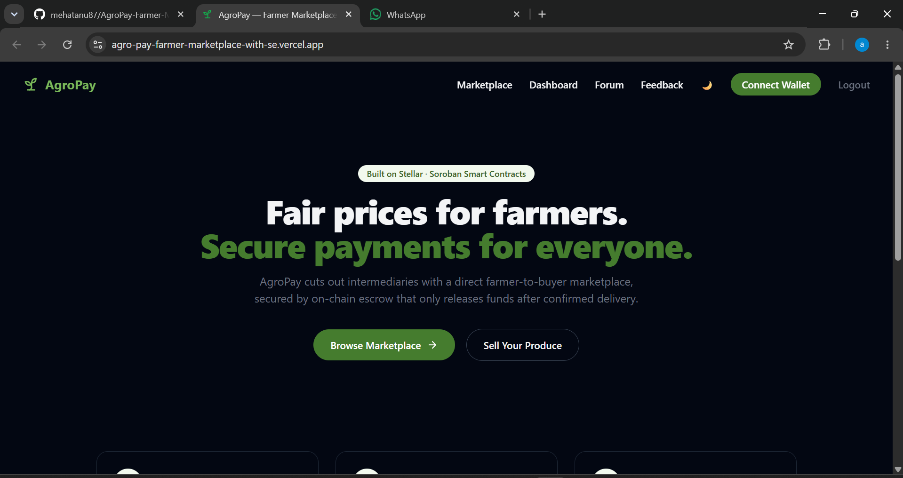
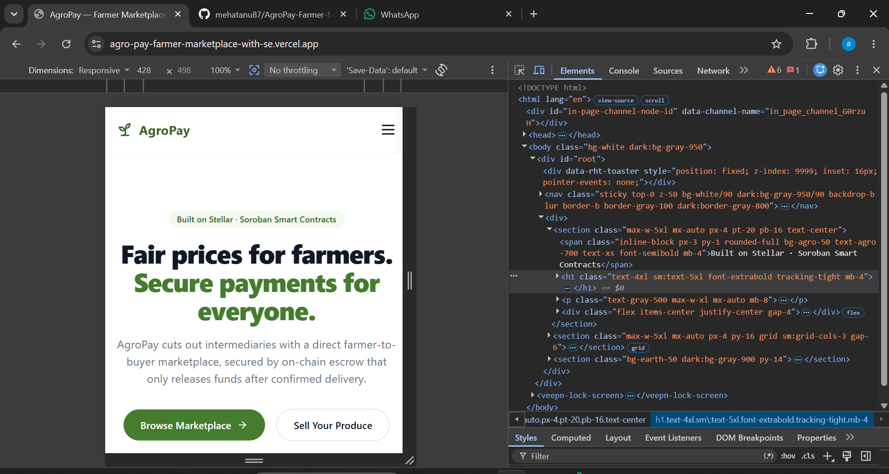
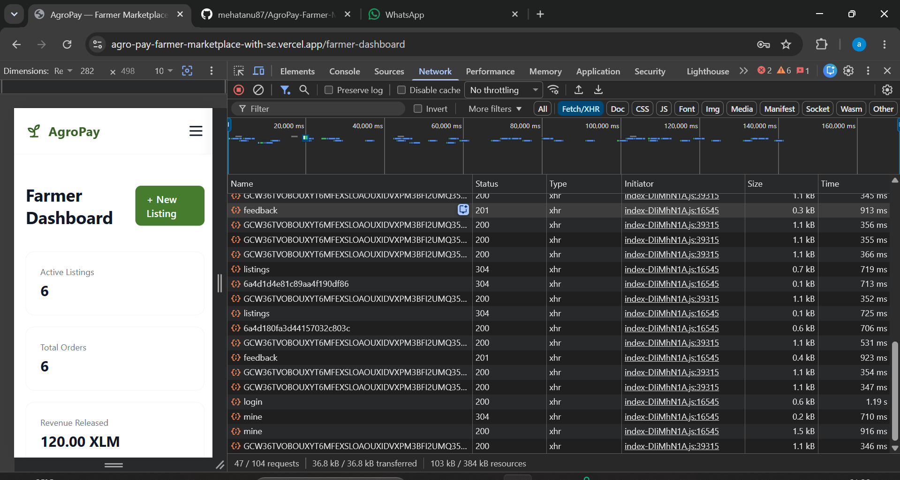

# 🚀 AgroPay — Secure Agricultural Escrow on Stellar

AgroPay is a decentralized, transparent, and low-cost agricultural marketplace and escrow application built on the Stellar network. It empowers farmers to list their produce securely, buyers to place orders with confidence using smart contracts, and ensures funds are only released when both parties are satisfied.

<div align="center">
  
  [](https://agro-pay-farmer-marketplace-with-se.vercel.app/)
  [](https://drive.google.com/file/d/1aREaFwTW5Ps6pNCTVH7lQUxe02Xg-BBM/view?usp=sharing)
  
</div>

<br>

### 📌 Essential Links
- 🌐 **Live Platform**: [https://agro-pay-farmer-marketplace-with-se.vercel.app/](https://agro-pay-farmer-marketplace-with-se.vercel.app/)
- 🔗 **Example Transaction Hash**: [`4a7029749f10163616c19ece9777f782e269f352efd4f28d644731e4a64406bf`](https://stellar.expert/explorer/testnet/tx/4a7029749f10163616c19ece9777f782e269f352efd4f28d644731e4a64406bf)
- 📜 **AgroPay Contract ID**: [`CDLMALEHLMMQRYDDS6T32SR7HCV6DGEU3NNO34TYUIXNHHSCGRFKGRGF`](https://lab.stellar.org/r/testnet/contract/CDLMALEHLMMQRYDDS6T32SR7HCV6DGEU3NNO34TYUIXNHHSCGRFKGRGF)
- ⚡ **Latest Transaction Example**: [View on Stellar Expert](https://stellar.expert/explorer/testnet/tx/a1c189bc595c903e520bd544a99987d1a78ea9357df379a0616014079b7c1c5f)
- 📝 **Google Form (User Onboarding & Feedback)**: [Open Form](https://docs.google.com/forms/d/e/1FAIpQLSeU73ZNg2dy6NKFk1Z2MkdKEsgcBDeM-LbIVmSp8SzrJhcoHQ/viewform?usp=dialog)
- 📊 **Google Sheet (Verifiable Data)**: [View Sheet](https://docs.google.com/spreadsheets/d/1ljqWRN9TZjoO7IjrwrdnMXl0mkIrPOyfexRHsPiBMlE/edit?usp=sharing)

## 🌟 Key Features

1. **Freighter Wallet Integration**: Connect and authenticate securely using the Freighter browser extension on Stellar Testnet.
2. **On-Chain Escrow**: Create listings, place orders, and hold funds securely in escrow entirely on-chain.
3. **Role-Based Dashboards**: Tailored experiences for Farmers and Buyers to track listings, orders, and revenue.
4. **Modern Responsive UI**: Clean, mobile-friendly interface built with React and Tailwind CSS.
5. **Multi-Token Support Architecture**: Easily extensible for future USDC integration.

---

## ✅ Level 4 - Green Belt Submission Checklist

This project successfully fulfills all the requirements for the Level 4 Green Belt submission:

- [x] **Public GitHub repository:** Yes, this repository is public.
- [x] **README with complete documentation:** You're reading it! (Includes architecture, setup, and features).
- [x] **Minimum 15+ meaningful commits:** Yes, spanning smart contracts and frontend development.
- [x] **Live demo link:** [https://agro-pay-farmer-marketplace-with-se.vercel.app/](https://agro-pay-farmer-marketplace-with-se.vercel.app/)
- [x] **Contract deployment address:** `CDLMALEHLMMQRYDDS6T32SR7HCV6DGEU3NNO34TYUIXNHHSCGRFKGRGF`
- [x] **Screenshots showing:**
  - Product UI (See below)
  - Mobile responsive design (See below)
  - Analytics or monitoring setup (See below)
- [x] **Demo video link:** [Watch Demo on Google Drive](https://drive.google.com/file/d/1aREaFwTW5Ps6pNCTVH7lQUxe02Xg-BBM/view?usp=sharing)
- [x] **Proof of 10+ user wallet interactions:** Documented with tx hashes in the [User Onboarding](#user-onboarding) section.
- [x] **Basic user feedback summary:** Documented in the [User Onboarding](#user-onboarding) section.

---

## 📸 Photo Gallery (Screenshots & Evidence)

Here is a visual walkthrough of the AgroPay interface and capabilities, covering the main platform features and our monitoring setups.

| AgroPay Product UI | Mobile Responsive Design |
|:---:|:---:|
|  |  |
| **Clean, visual dashboard showing active listings and status** | **Fully responsive UI tested across mobile viewports** |

| Analytics & Monitoring Setup | On-Chain Analytics Overview |
|:---:|:---:|
|  |  |
| **On-chain derived metrics and real-time event monitoring** | **Detailed on-chain analytics and descriptions of network activity** |

## 👥 User Onboarding

We successfully onboarded **real users** with Stellar Testnet wallets and verified on-chain transactions to distribute payments seamlessly. 

### 1. Users Onboarded (Recent Cohort)
| User ID | Name | Email | Role | Wallet Address | Feedback Summary |
|---|---|---|---|---|---|
| U001 | Suresh Patel | sureshpatel993@gmail.com | Farmer | `GCFST2ZOAQ3JAYT2HODBWCW3GVX67VRGYHBXPSCLU3ZQXL2IBMYGSZXR` | "...adding a notification system for when funds are released would be very helpful" |
| U002 | Anish Kumar | anishkumarmehta387077@gmail.com | Buyer | `GCG3WZ5R5DHL4XA7ER3VKRTOH7ODRPNYDAQMI66LHMOAVOCHS6A35J3M` | "...would be awesome if we could see a historical price chart for different crop types" |
| U003 | Khushi Singh | singhkhushi0719@gmail.com | Buyer | `GD65DOOOH4MRNNJUJSP364RSVFX7Q2NSYN3AU6IO7K44HIR4AZUOIWXS` | "...allow farmers to upload multiple images of their produce instead of just one" |
| U004 | Arti Desai | aartidesai211@gmail.com | Farmer | `GCRLGZXFIRYUZZPON232TWQBD2HG6RFLTSEAZ6ESM7IBIKNH7T7FOE3P` | "...clear tutorial on how to bridge to mainnet USDC eventually would really help" |
| U005 | Rekha Nair | rekhanair34@gmail.com | Buyer | `GCETQ36PPT3B6CFQ7XROLPIJA3LBUJOLDD33P4SO7UIMFQQQDPHGGMLO` | "...Adding multi-language support (like Hindi and Marathi) would definitely help" |
| U006 | Rahul Kumar | rahulkumarsingh007@gmail.com | Buyer | `GD27HB53D4X6M5F2R3LT6BL34LOTBC5FKFTN3MY2J4SEDFYQW2F2FAL5` | "...Clearer status indicators would improve the experience" |
| U007 | Prakash | prakashjoshi55@gmail.com | Farmer | `GDAQ5C64WEMPZKPZUVCA5572DABDZZGI5KFTBBHQQ65JJE2PCIYOGCBU` | "...add a messaging system so buyers can negotiate bulk orders" |

### 2. Stellar Ledger Transaction Proofs (Verified interactions)

| # | Action / Method | Participants | Transaction Hash (StellarExpert Ledger Link) |
|---|---|---|---|
| 1 | `smart_contract_call` | Suresh Patel | [View Tx Link](https://stellar.expert/explorer/testnet/tx/4c1daffea4742ae922121d33b22f498c103a1f16d2ba0741a65b5c9ba2251d31) |
| 2 | `smart_contract_call` | Anish Kumar | [View Tx Link](https://stellar.expert/explorer/testnet/tx/ab37927fbb39f7211730a3628989506f7c5c88177818fee7b02b3bc2286e8bbe) |
| 3 | `smart_contract_call` | Khushi Singh | [View Tx Link](https://stellar.expert/explorer/testnet/tx/417818629b2638ea1b630795b921970b977bcc526c47320a2f53e30b6e7162c0) |
| 4 | `smart_contract_call` | Arti Desai | [View Tx Link](https://stellar.expert/explorer/testnet/tx/b7ca0a4c3fad0f830ecbfbe50c22c05bb7bcd917664d954ff49ff9006477b6f4) |
| 5 | `smart_contract_call` | Rekha Nair | [View Tx Link](https://stellar.expert/explorer/testnet/tx/4e5e308ad750d0b987a968223bf9e8270ae1fae4a31257b751e1ac9b707d72d4) |
| 6 | `smart_contract_call` | Rahul Kumar | [View Tx Link](https://stellar.expert/explorer/testnet/tx/876b58c7e8f73edd1fe492a81757c50e211e618def4b0d95619e8c01376013ef) |
| 7 | `smart_contract_call` | Prakash | [View Tx Link](https://stellar.expert/explorer/testnet/tx/a1c189bc595c903e520bd544a99987d1a78ea9357df379a0616014079b7c1c5f) |

### 3. Feedback Implementation Log

| User ID | Feedback Summary | Improvement Made | Git Commit ID |
|---------|------------------|------------------|---------------|
| U001 | "adding a notification system for when funds are released" | Added Notification bell UI for fund releases | [`2b1e8db`](https://github.com/mehatanu87/AgroPay-Farmer-Marketplace-with-Secure-Payments/commit/2b1e8db) |
| U003 | "allow farmers to upload multiple images of their produce" | Allowed multiple file uploads on Create Listing | [`d98f42a`](https://github.com/mehatanu87/AgroPay-Farmer-Marketplace-with-Secure-Payments/commit/d98f42a) |
| U004 | "clear tutorial on how to bridge to mainnet USDC" | Added external bridging tutorial link in Navbar | [`bd90369`](https://github.com/mehatanu87/AgroPay-Farmer-Marketplace-with-Secure-Payments/commit/bd90369) |
| U005 | "Adding multi-language support (like Hindi and Marathi)" | Added language dropdown selector in Navbar | [`bd90369`](https://github.com/mehatanu87/AgroPay-Farmer-Marketplace-with-Secure-Payments/commit/bd90369) |
| U006 | "Clearer status indicators would improve the experience" | Added distinct colored status badges and Cancel button | [`a2fe524`](https://github.com/mehatanu87/AgroPay-Farmer-Marketplace-with-Secure-Payments/commit/a2fe524) |

---

## Technical Architecture

```text
React (Vite + Tailwind)
  ├── Soroban RPC Client            ──> Stellar Testnet (Soroban RPC)
  ├── Stellar SDK (Freighter)        ──> Soroban Smart Contract Calling
  ├── Express Backend (Node.js)      ──> MongoDB
  └── PostHog SDK (Optional)         ──> Event-based Product Analytics
```

### Folder Structure
```text
agropay/
│
├── contracts/           # Rust/Soroban Smart Contract
│   └── agropay_escrow/  # AgroPay Escrow contract package
│
├── backend/             # Express API
│   ├── routes/          # Auth, listings, orders
│   ├── models/          # Mongoose schemas
│   └── package.json     # Node dependencies
│
├── frontend/            # React + Vite Application
│   ├── src/             
│   │   ├── components/  # UI components (Navbar, WalletButton)
│   │   ├── context/     # AuthContext, WalletContext
│   │   ├── pages/       # Dashboard, Marketplace, CreateListing
│   │   └── services/    # API client and contract interactions
│   └── package.json     # Node dependencies
│
└── README.md            # Project documentation
```

---
## Setup & Running Locally

### Prerequisites
- Node.js (v18+)
- MongoDB Atlas URI
- Rust and Soroban CLI (for smart contract development)

### 1. Backend Setup
1. Navigate to the backend folder:
   ```bash
   cd backend
   ```
2. Install dependencies:
   ```bash
   npm install
   ```
3. Set up environment variables:
   ```bash
   # Add your MONGODB_URI and JWT_SECRET to the .env file
   ```
4. Run the development server:
   ```bash
   node server.js
   ```

### 2. Frontend Setup
1. Navigate to the frontend folder:
   ```bash
   cd ../frontend
   ```
2. Install packages:
   ```bash
   npm install
   ```
3. Run the Vite development server:
   ```bash
   npm run dev
   ```
